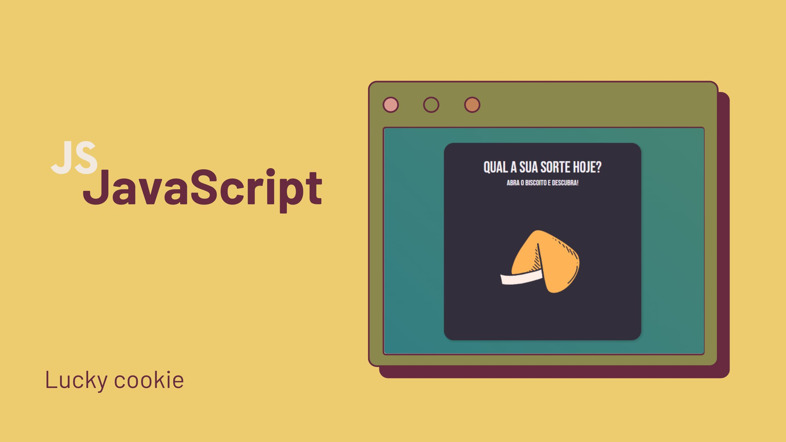

<h1 align="center">#BISCOITO DA SORTE</h1>
<h2 align="center">Biscoito da Sorte</h2>

  Página do Biscoito da Sorte

  <a href="#-tecnologias">Tecnologias</a>&nbsp;&nbsp;&nbsp;|&nbsp;&nbsp;&nbsp;
  <a href="#-projeto">Projeto</a>&nbsp;&nbsp;&nbsp;|&nbsp;&nbsp;&nbsp;
  <a href="#-layout">Layout</a>&nbsp;&nbsp;&nbsp;|&nbsp;&nbsp;&nbsp;

  

 

  

## 🚀 Tecnologias
- HTML: Linguagem de marcação para estruturar o conteúdo da página.
- CSS: Estilização do site.
- JavaScript: Implementado para interações dinâmicas na página.
- Figma/Canva (desing)

## 💻 Projeto
O Biscoito da Sorte é uma aplicação web simples que simula a experiência de abrir um biscoito da sorte, revelando uma mensagem aleatória para o usuário.

## :wrench: Funcionalidades
Ao clicar no biscoito, uma mensagem aleatória é exibida.
O usuário pode abrir outro biscoito clicando no botão "Abrir outro biscoito".
A aplicação possui animações para tornar a experiência mais divertida.

- Você pode visualizar o layout do projeto através [DESTE LINK](<https://github.com/JasonAraujo1/Lucky-cookie>).

## :memo: Licença
Este projeto está sob a licença MIT.

---

Instruções por [Sua Empresa/Equipe](https://seusite.com) :wave: [Participe da nossa comunidade!](https://discord.gg/sua-comunidade)
